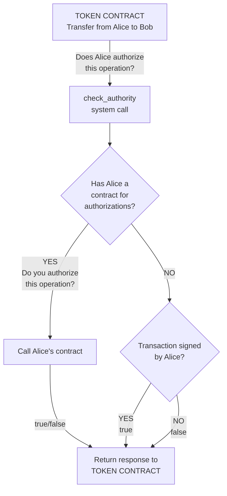

A contract standard for tokens on the Koinos blockchain.

## Long Description

This standard is to define how tokens can work on the Koinos blockchain.

Tokens using this standard may include additional utility and functionality beyond this standard in their smart contract logic. This document defines the base functionality in order to adhere to KCS-1 standard.

## Why

This is the first standard for token contracts on the Koinos blockchain. The most representative examples are KOIN and VHP contracts. Every smart contract platform requires fungible tokens at a bare minimum which allows users to to utilize the decentralized ledger and trade value amongst themselves.

## Specification

At a minimum, a token contract using this standard will include the following methods and unique data:

### Read methods

#### name

Returns the name of the token. No arguments required.

Protobuf definition

```proto
// Arguments
message name_arguments {}

// Result
message name_result {
   string value = 1;
}
```

#### symbol

Returns the symbol for the token. No arguments required.

Protobuf definition

```proto
// Arguments
message symbol_arguments {}

// Results
message symbol_result {
   string value = 1;
}
```

#### decimals

Returns the decimal precision of the token. No arguments required.

Protobuf definition:

```proto
// Arguments
message decimals_arguments {}

// Result
message decimals_result {
   uint32 value = 1;
}
```

#### total_supply

Returns the total supply of the token. No arguments required.

Protobuf definition:

```proto
// Arguments
message total_supply_arguments {}


// Result
message total_supply_result {
   uint64 value = 1 [jstype = JS_STRING];
}
```

#### balance_of

Returns how many tokens a specific address holds.

Protobuf definition:

```proto
// Arguments
message balance_of_arguments {
   bytes owner = 1 [(btype) = ADDRESS];
}

// Result
message balance_of_result {
   uint64 value = 1 [jstype = JS_STRING];
}
```

### Write methods

#### mint

Used by the contract owner to initially mint the token to a given address.

Protobuf definition:

```proto
// Arguments
message mint_arguments {
   bytes to = 1 [(btype) = ADDRESS];
   uint64 value = 2 [jstype = JS_STRING];
}

// Result
message mint_result {}
```

The method should emit a `mint_event` upon success. The event should indicate the recipient of the mint as an impacted account.

```proto
// Event
message mint_event {
   bytes to = 1 [(btype) = ADDRESS];
   uint64 value = 2 [jstype = JS_STRING];
}
```

#### transfer

This will transfer tokens to a new owner. The authorization is checked with the native `check_authority` system call. It is also authorized if the contract of `from` is the one that called the token contract.

Protobuf definition:

```proto
// Arguments
message transfer_args {
   bytes from = 1 [(koinos.btype) = ADDRESS];
   bytes to = 2 [(koinos.btype) = ADDRESS];
   uint64 value = 3 [jstype = JS_STRING];
}

// Result
message transfer_result {}
```

The transfer event should emit a `transfer_event` upon success. The event should indicate the sender and receiver as impacted accounts.

```proto
// Event
message transfer_event {
   bytes from = 1 [(btype) = ADDRESS];
   bytes to = 2 [(btype) = ADDRESS];
   uint64 value = 3 [jstype = JS_STRING];
}
```

#### burn (optional)

Burns an amount of token from an address. The authorization is checked with the native `check_authority` system call. It is also authorized if the contract of `from` is the one that called the token contract.

Protobuf definition:

```proto
// Arguments
message burn_args {
   bytes from = 1 [(koinos.btype) = ADDRESS];
   uint64 value = 2 [jstype = JS_STRING];
}

// Result
message burn_result {}
```

The method should emit a `burn_event` upon success. The event should indicate the source as an impacted account.

```proto
// Event
message burn_event {
   bytes from = 1 [(btype) = ADDRESS];
   uint64 value = 2 [jstype = JS_STRING];
}
```

## Computation of entry points

On the Koinos blockchain, each contract function has an _entry point_ associated which should be referenced inside the transaction when interacting with the contract. This _entry point_ is used to identify the function, not the name of the function.

The current standard uses the following process to define the entry point:

1. Compute the sha256 of the name function.
2. Take the first 4 bytes of the hash.
3. Convert these bytes into a number.

For instance, the sha256 of `transfer` is `27f576cafbb263ed44be8bd094f66114da26877706f96c4c31d5a97ffebf2e29`. Then the _entry point_ for this function is defined as 0x27f576ca

## Expected Unique Data and Types

With the proposed implementation developers would set the following constants before uploading their token contract:

- `NAME` - a string for the human readable name of the token.
- `SYMBOL` - a string for the symbol or ticker used for the token (all uppercase).
- `DECIMALS` - a u32 for the decimal precision of the token.

## Check authority system call

The koinos framework comes with an innovative system for authorizations, where users can upload personal contracts that will be called to resolve authorizations. In order to take advantage of this feature, the token contract should call the `check_authority` system call. And it works in this way:

1. If the user has a smart contract, and he has configured it with an `authorize` function, then this smart contract will be called to resolve the authority.
2. If the user doesn't have a smart contract, then the blockchain will search if the user signed the transaction and in that case approve the authorization.

This is a flow chart of the system call:



## Implementation

There are some implementations of this token contract.

- [Token contract](https://github.com/roaminro/koinos-sdk-as-examples/blob/4e68844d41a53bcf1f5a43056d9a638b544d816c/token/assembly/Token.ts)
- [KOIN token](https://github.com/koinos/koinos-contracts-cpp/blob/80f55538a5fbf6526e2e1df93d9bf4981eb6c2e7/contracts/koin/koin.cpp) (written in C++)
- [VHP Token](https://github.com/koinos/koinos-contracts-as/blob/213277bc9c54dd049d7797a657dac890e8207560/contracts/vhp/assembly/Vhp.ts)

## References

- [Koinos authority system explained by Michael Vandeberg (video)](https://www.youtube.com/watch?v=lDsAQ7y9XTw).