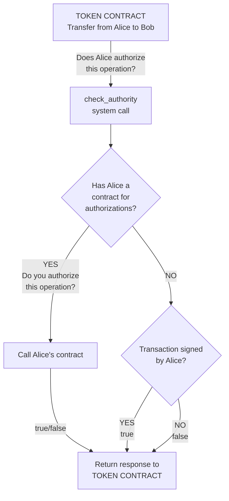

A contract standard for tokens on the Koinos blockchain.

## Long Description

This standard is to define how tokens can work on the Koinos blockchain.

Tokens using this standard may include additional utility and functionality beyond this standard in their smart contracting. This is only a base layer of functionality that is expected.

## Why

This is the first standard for token contracts in koinos blockchain. The most representative examples are KOIN and VHP contracts.

## Specification

At a minimum, a token contract using this standard will include the following methods and unique data:

### Read methods

#### name

Returns the name of the token. No arguments required.

```ts
// entry_point: 0x82a3537f
// read_only: true
name(): token.str {}
```

Protobuffers:

```proto
// Return
message str {
   string value = 1;
}
```

#### symbol

Returns the symbol for the token. No arguments required.

```ts
// entry_point: 0xb76a7ca1
// read_only: true
symbol(): token.str {}
```

Protobuffers:

```proto
// Return
message str {
   string value = 1;
}
```

#### decimals

Returns the decimal precision of the token. No arguments required.

```ts
// entry_point: 0xee80fd2f
// read_only: true
decimals(): token.uint32 {}
```

Protobuffers:

```proto
// Return
message uint32 {
   uint32 value = 1;
}
```

#### total_supply

Returns the total supply of the token. No arguments required.

```ts
// entry_point: 0xb0da3934
// read_only: true
total_supply(): token.uint64 {}
```

Protobuffers:

```proto
// Return
message uint64 {
   uint64 value = 1 [jstype = JS_STRING];
}
```

#### balance_of

Returns how many tokens a specific address holds.

```ts
// entry_point: 0x5c721497
// read_only: true
balance_of(args: token.balance_of_args): token.uint64 {}
```

Protobuffers:

```proto
// Arguments
message balance_of_args {
   bytes owner = 1 [(koinos.btype) = ADDRESS];
}

// Return
message uint64 {
   uint64 value = 1 [jstype = JS_STRING];
}
```

### Write methods

### mint

Used by the contract owner to initially mint the token to a given address.

```ts
// entry_point: 0xdc6f17bb
// read_only: false
mint(args: token.mint_args): void {}
```

Protobuffers:

```proto
// Arguments
message mint_args {
   bytes to = 1 [(koinos.btype) = ADDRESS];
   uint64 value = 2 [jstype = JS_STRING];
}
```

### transfer

This will transfer tokens to a new owner. The authorization is checked with the native `check_authority` system call. It is also authorized if the contract of `from` is the one that called the token contract.

```ts
// entry_point: 0x27f576ca
// read_only: false
transfer(args: token.transfer_args): void {}
```

Protobuffers:

```proto
// Arguments
message transfer_args {
   bytes from = 1 [(koinos.btype) = ADDRESS];
   bytes to = 2 [(koinos.btype) = ADDRESS];
   uint64 value = 3 [jstype = JS_STRING];
}
```

### burn (optional)

Burns an amount of token from an address. The authorization is checked with the native `check_authority` system call. It is also authorized if the contract of `from` is the one that called the token contract.

```ts
// entry_point: 0x859facc5
// read_only: false
burn(args: token.transfer_args): void {}
```

Protobuffers:

```proto
// Arguments
message burn_args {
   bytes from = 1 [(koinos.btype) = ADDRESS];
   uint64 value = 2 [jstype = JS_STRING];
}
```

## Expected Unique Data and Types

With the proposed implementation developers would set the following constants before uploading their token contract:

- `NAME` - a string for the human readable name of the token.
- `SYMBOL` - a string for the symbol or ticker used for the token (all uppercase).
- `DECIMALS` - a u32 for the decimal precision of the token.

## Check authority system call

The koinos framework comes with an innovative system for authorizations, where users can upload personal contracts that will be called to resolve authorizations. In order to take advantage of this feature, the token contract should call the `check_authority` system call. And it works in this way:

1. If the user has a smart contract, and he has configured it with an `authorize` function, then this smart contract will be called to resolve the authority.
2. If the user doesn't have a smart contract, then the blockchain will search if the user signed the transaction and in that case approve the authorization.

This is a flow chart of the system call:



## Implementation

There are some implementations of this token contract.

- [Token contract](https://github.com/roaminro/koinos-sdk-as-examples/blob/4e68844d41a53bcf1f5a43056d9a638b544d816c/token/assembly/Token.ts)
- [KOIN token](https://github.com/koinos/koinos-contracts-cpp/blob/80f55538a5fbf6526e2e1df93d9bf4981eb6c2e7/contracts/koin/koin.cpp) (written in C++)
- [VHP Token](https://github.com/koinos/koinos-contracts-as/blob/213277bc9c54dd049d7797a657dac890e8207560/contracts/vhp/assembly/Vhp.ts)

## References

- [Koinos authority system explained by Michael Vandeberg (video)](https://www.youtube.com/watch?v=lDsAQ7y9XTw).
